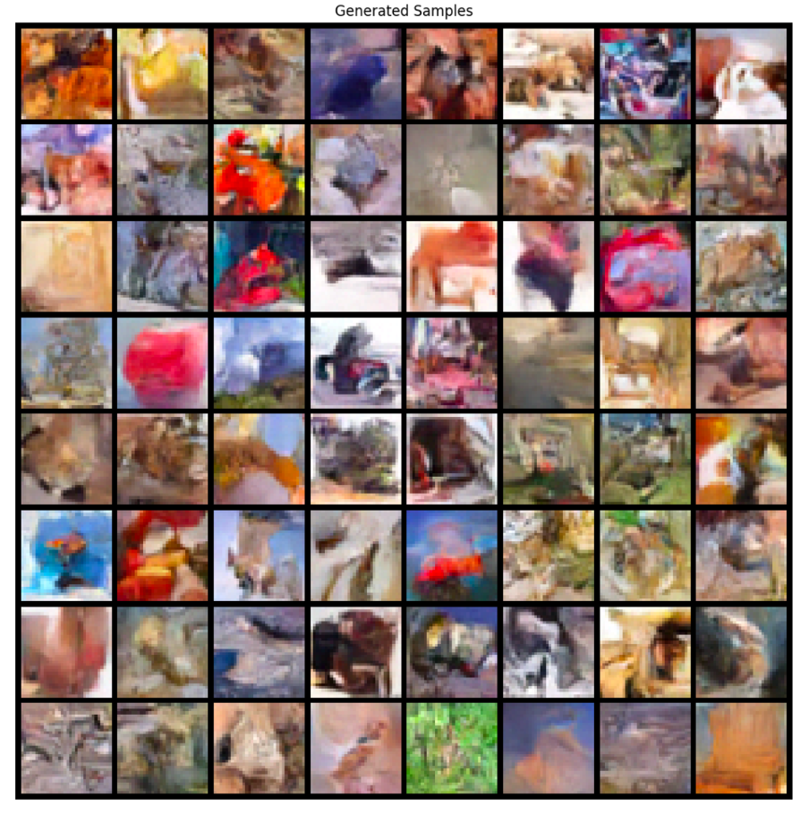
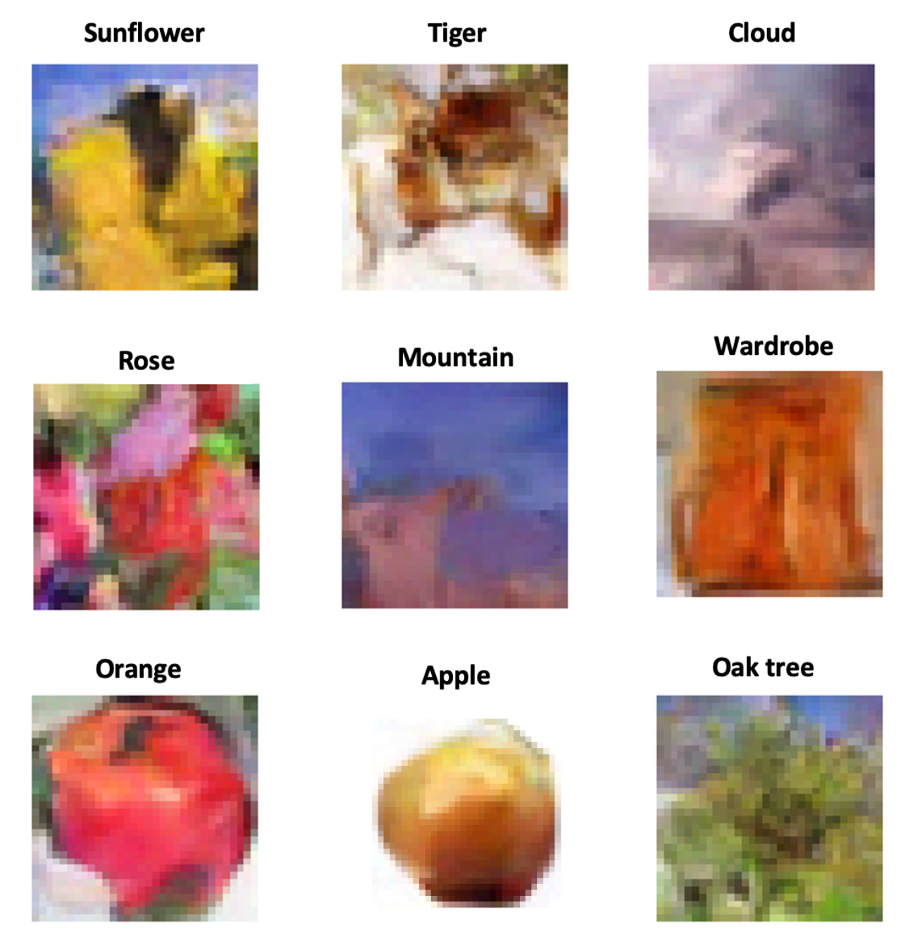

  

# Efficient CIFAR-100 Image Classification and Generation using Small-Parameter Models

This work proposes using a **ResNet-inspired CNN** for image classification and a **conditional denoising diffusion probabilistic model (DDPM)** for image generation, trained on the **CIFAR-100** dataset.

Both models were deliberately designed with a restricted parameter budget, enabling a controlled study of how model capacity influences representation learning, generalisation, and generative quality under limited computational resources. This constraint reflects realistic scenarios where efficiency, training time, and hardware limitations are critical considerations.

The discriminative model learned basic image shapes effectively but struggled with fine-grained details. The generative model produced realistic shapes and textures with good diversity; simpler object classes yielded more convincing results, while complex classes remained challenging. For both models, performance was constrained by **parameter limits and training time**.

---

## Context

This work was carried out as a **Computer Science project at Durham University**.

---

## Results

### Random samples (non-cherry-picked)

Batch of 64 randomly generated, non-cherry-picked images produced by the DDPM.

  

---

### Cherry-picked samples

Selected examples highlighting the best qualitative results from the DDPM.

  

